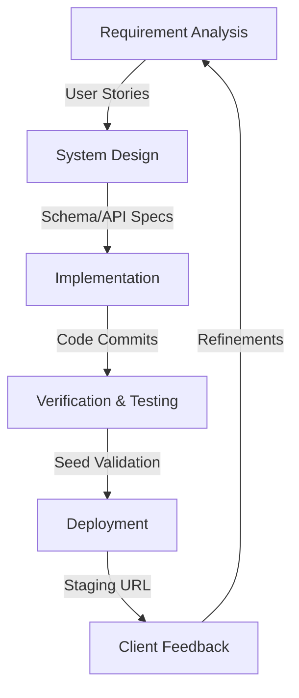

# Schools24 - Software Development Life Cycle (SDLC)

**Project:** Schools24 Management Platform
**Methodology:** Agile (Iterative & Incremental)
**Version:** 2.0
**Last Updated:** February 2, 2026

---

## 1. Executive Overview

The **Schools24 SDLC** defines the end-to-end engineering process used to deliver a high-performance, scalable School Management System. We adhere to an **Agile** methodology, creating functional increments in 1-week Sprints. This ensures rapid adaptability to client feedback (e.g., Frontend Reworks) while maintaining robust backend stability through Go-based validation.

---

## 2. Technology Stack & Toolchain

The SDLC is optimized for our specific high-performance stack:

| Component | Technology | Role |
| :--- | :--- | :--- |
| **Frontend** | **Next.js 14 / React** | Server-Side Rendering (SSR) & Dynamic UIs |
| **Backend** | **Go (Golang) / Gin** | High-concurrency API services |
| **Database** | **PostgreSQL (pgx)** | Relational data persistence |
| **Testing** | **Go Seed Scripts** | Data integrity & relationship verification |
| **DevOps** | **Docker** | Containerization & Deployment |

---

## 3. The Development Lifecycle Process

### Phase 1: Requirement Analysis
**Input:** Client Feedback, "Week-X Progress Reports".
- Creating **User Stories**: "As a Super Admin, I need to create School Tenants."
- Defining **Acceptance Criteria**: "Must handle 50+ concurrent student records."

### Phase 2: System Design
**Input:** User Stories.
- **Database Modeling**: designing normalized SQL schemas (e.g., `students` linked to `users` and `classes`).
- **API Contract**: Defining JSON responses for endpoints (e.g., `GET /api/v1/students`).

### Phase 3: Implementation (Coding)
**Input:** Design Docs.
- **Backend First**: Developing Go handlers and repositories to ensure business logic is sound.
- **Frontend Parallel**: Building UI components (e.g., `StudentTable.tsx`) using mocked interfaces until backend is ready.
- **Integration**: Connecting the React Frontend to Go APIs using **Axios**.

### Phase 4: Verification & Quality Assurance
**Input:** Integrated Code.
- **Seed-Based Testing**: Unlike standard unit tests, we run **Live Seed Scripts** (e.g., `seed_students.go`) to generate thousands of records.
- **Logic Validation**: Scripts like `check_db_students.go` verify that constraints (Foreign Keys, NOT NULL) are satisfied in a real database environment.
- **Bug Fixes**: Addressing specific issues (e.g., "Status Field Removal").

### Phase 5: Deployment & Delivery
**Input:** Validated Build.
- **Optimization**: Compiling Go binaries and building Next.js static assets.
- **Release**: Deploying to the Staging Environment.
- **Reporting**: Generating the **Weekly Client Report** to document progress.

---

**Confidential Property of Schools24 / UpCraft Solutions**
