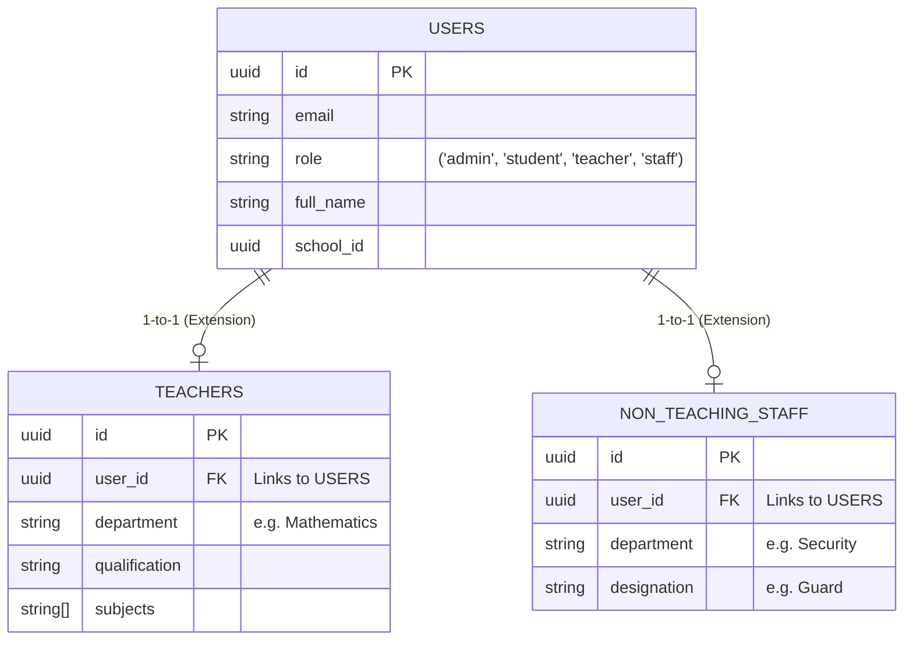
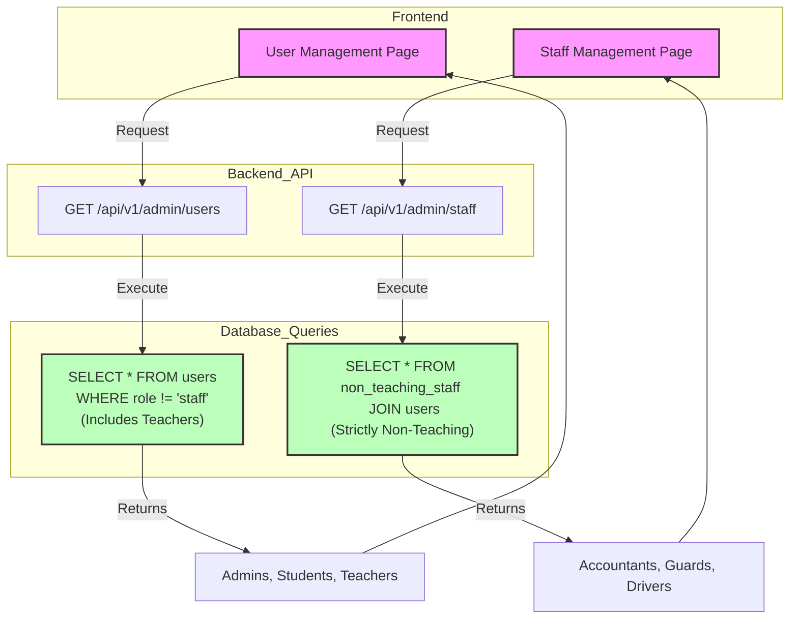

# System Architecture: User & Staff Isolation

This document illustrates how the application separates User Management from Staff Management at the database and API levels.

## 1. Database Schema (The "Source of Truth")

The system uses a **Base Table + Extension Table** pattern. Everyone is a User, but specialized roles have extra tables.

## 2. API & Data Flow (The "Isolation Logic")

The Frontend calls distinct APIs. The Backend runs distinct queries to ensure no overlap.

## Key Distinctions

| Feature | User Management (`/users`) | Staff Management (`/staff`) |
| :--- | :--- | :--- |
| **Target Roles** | Admin, Student, **Teacher** | **Non-Teaching Staff** (only) |
| **Primary Table** | `users` | `non_teaching_staff` |
| **Logic** | "Show everyone except support staff" | "Show only support staff" |
