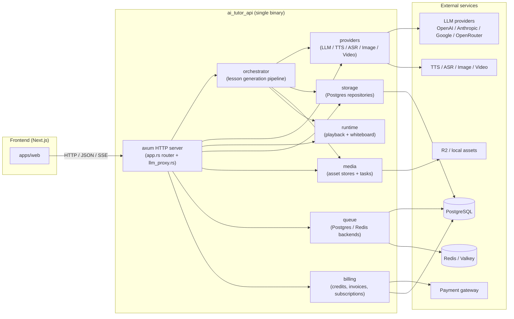
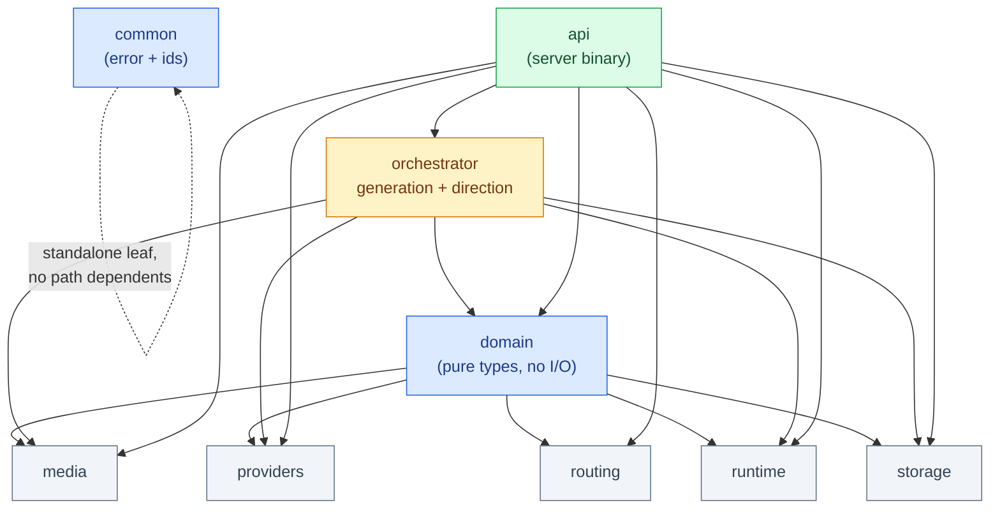
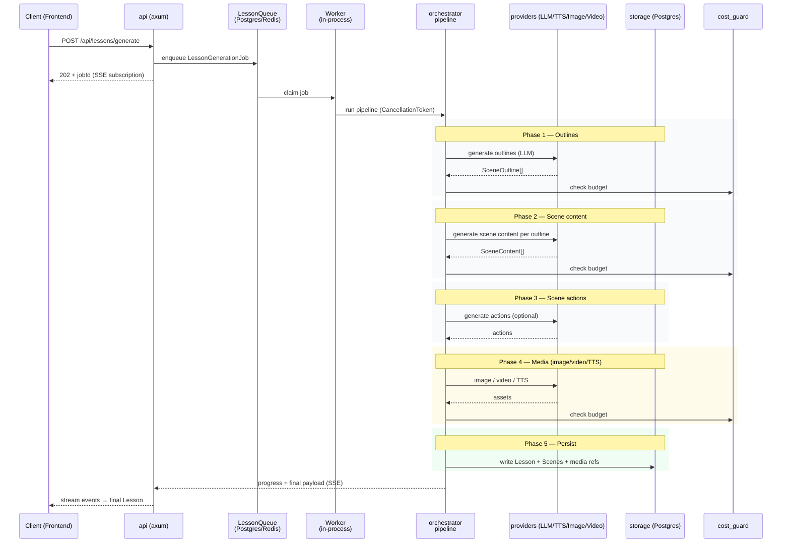
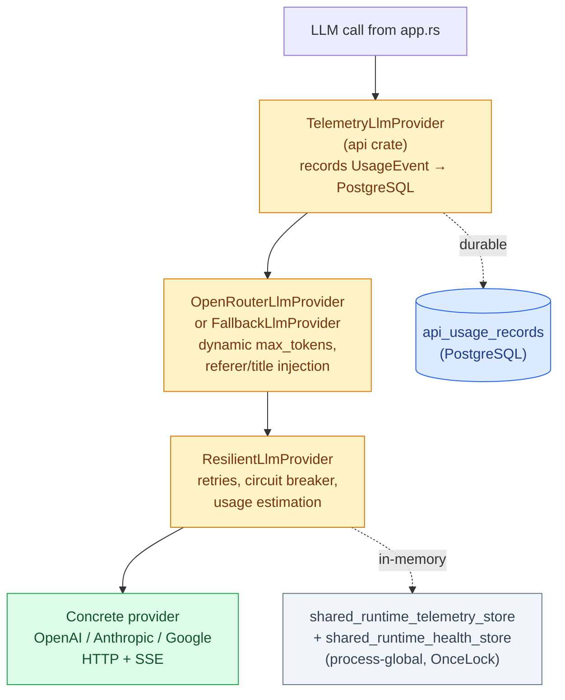
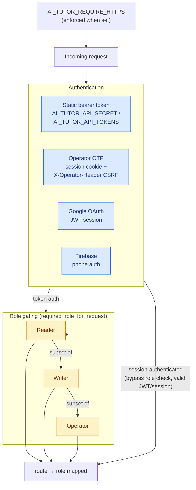

# AI-Tutor Backend Architecture

> Source root: `AI-Tutor-Backend/`
> Last verified: 2026-08-26 (read against the working tree, `Cargo.toml`s, and `main.rs`)

## 1. Purpose

A Rust **modular monolith** that translates OpenMAIC's Node.js backend into a
Rust-native system. One deployable binary (`ai_tutor_api`) is built from the
`api` crate; orchestration, providers, storage, routing, runtime, and media are
internal crates composed into it. The backend owns lesson generation
orchestration, provider abstraction, job execution, persistence, and live
session control. The frontend is a separate client that calls this API.

## 2. High-level system topology

The backend is a single process (`ai_tutor_api`) that fronts multiple
external systems and serves the frontend over HTTP/JSON + SSE.



## 3. Workspace layout

```
AI-Tutor-Backend/
├── Cargo.toml                 # workspace, 9 members, edition 2021, resolver 2
├── Dockerfile                 # cargo-chef staged build → debian:bookworm-slim runtime
├── render.yaml                # Render blueprint (free web + keyvalue)
├── rust-toolchain.toml
├── crates/
│   ├── api/                   # HTTP server (axum), billing, queue, auth, telemetry
│   ├── common/                # error + ids (standalone leaf crate)
│   ├── domain/                # pure domain types (no I/O) — the shared vocabulary
│   ├── orchestrator/          # lesson generation pipeline + runtime director
│   ├── providers/             # LLM/TTS/ASR/image/video provider impls behind traits
│   ├── routing/               # model + capability + budget routing rules
│   ├── runtime/               # session playback + whiteboard doubt session
│   ├── storage/               # Postgres + filesystem repositories
│   └── media/                 # asset stores (local + R2), media task helpers
├── docs/                      # system-design, DATABASE_SCHEMA, runbooks, etc.
├── migrations/                # ⚠ partial only (2 files); real schema is embedded
│                               #   in crates/storage/src/filesystem.rs
├── data/                      # local SQLite-ish dev DBs (runtime.db, queue.db) — dev only
└── *.py / *.rs / *.rlib        # ⚠ orphaned scratch/patch scripts, NOT in build graph
```

### Key workspace dependencies (from `Cargo.toml`)

`axum 0.8`, `tokio 1` (multi-thread), `sqlx 0.8` (postgres/rustls),
`reqwest 0.12.24` (rustls), `serde`/`serde_json`, `uuid v4`, `jsonwebtoken 8.3`,
`chrono` + `chrono-tz`, `rusty-s3`, `markitdown`, `tracing`/`tracing-subscriber`,
`anyhow`, `thiserror`, `async-trait`. Release profile: `opt-level=3`, LTO off,
16 codegen units (Dockerfile overrides these to avoid Render OOM).

## 4. Crate dependency graph

Internal crate dependencies were verified by reading each crate's `Cargo.toml`.
`domain` is the foundation (no internal deps); every other crate builds on it.
`orchestrator` and `api` are the composition roots that pull the others together.



> `common` (error + ids) is a workspace member with no internal path-dependents
> in the current graph. It is a standalone leaf — confirm intent before wiring
> it in, since it is not currently on the hot dependency path.

## 5. Crates in detail

### `api` — the server (`crates/api/src/`)

Entry: `main.rs` → builds `LiveLessonAppService`, wires providers/storage/queue,
runs startup readiness checks, calls `app::build_router`.

- `app.rs` (713 KB, **18,957 lines**, 138 structs, 253 fns, 65 inline tests) — a
  **megafile** mixing 5 concerns: core types + auth middleware/role gating, ~110
  DTO structs, the `LessonAppService` trait, PBL runtime agents/prompts, the
  axum route table (`build_router_with_auth`), and ~90 HTTP handlers + helpers,
  plus a ~5,950-line `#[cfg(test)] mod tests` block. Auth supports: static
  `AI_TUTOR_API_SECRET`/`AI_TUTOR_API_TOKENS` bearer tokens, operator OTP
  sessions (cookie + `X-Operator-Header` CSRF), Google OAuth JWT sessions, and
  Firebase phone auth. `build_router(service)` is the single route-registration
  point. **A decomposition plan exists at
  [`docs/backend/APP_RS_REFACTOR_PLAN.md`](./APP_RS_REFACTOR_PLAN.md) — not yet
  executed.** Internal layout: core/auth 1–563, DTOs 564–1673, service trait
  1674–1803, PBL agents ~7800–8071, route table 8072–8198, handlers/helpers
  8257–12969, tests 13004–18957.
- `llm_proxy.rs` — a separate axum router exposing `/api/generate/llm`,
  `/api/generate/llm/stream`, `/api/generate/profiles` (provider passthrough).
- `queue.rs` / `queue_postgres.rs` / `queue_redis.rs` — the `LessonQueue`
  abstraction with Postgres and Redis/Valkey backends; stale-job reaping,
  heartbeats, one-shot queue kicks.
- `billing_*` — `billing_catalog`, `billing_event_queue`, `billing_processor`,
  `billing_scheduler`, `subscription_scheduler`: credit ledger, invoices,
  subscriptions, dunning, promo codes, payment intents.
- `payment_gateway.rs` — `resolve_payment_gateway()` pluggable gateway.
- `invoice_renderer.rs` + `invoice_template.typ` — Typst-based invoice PDF.
- `notifications.rs` + `templates/*.html` — email templates (payment success/
  fail, grace period, operator OTP, service restricted, cost alert).
- `telemetry.rs` / `telemetry_provider.rs` — usage events + per-provider usage.
- `redis_balance_cache.rs` / `redis_storage.rs` — Redis-backed balance cache
  and runtime session repository.
- `cleanup.rs`, `alerting.rs`, `env_helpers.rs`, `startup_readiness.rs`,
  `tools.rs` — operational helpers.
- `tests/` — `oauth_e2e_stability`, `e2e_verification`.

### `domain` — pure types (`crates/domain/src/`)

No I/O. Modules: `action`, `auth` (TutorAccount, RefreshToken),
`billing` (+`billing_entities`), `credits`, `gateway`, `generation`
(LessonGenerationRequest, Language, UserRequirements, AgentMode),
`job` (LessonGenerationJob, status/step enums), `lesson`, `lesson_adaptive`,
`lesson_shelf`, `provider` (ModelConfig), `routing` (GenerationTask,
QualityTier, TopicComplexity, GenerationBudget, compute helpers),
`runtime` (DirectorState, RuntimeActionExecutionRecord, StatelessChatRequest),
`scene` (Scene, SceneContent, SceneOutline, Stage, ProjectConfig, agents),
`school`, `wallet`. **This is the shared vocabulary every other crate speaks.**

### `orchestrator` — generation + live direction (`crates/orchestrator/src/`)

- `pipeline.rs` (~2k lines) — `LessonGenerationPipeline` trait +
  `LessonGenerationOrchestrator<P,L,J>`. Phases: outlines → scene content →
  scene actions → optional title/agents → media (image/video/TTS) → persist.
  Cancellation via `CancellationToken`; cost guard integration.
- `engine.rs` — `LearningProfile`, `LayoutConstraints`, budget computation from
  `learning_mode` (exam/revision/placement_prep/explain) and `quality_mode`
  (basic/standard/premium).
- `generation/` — `outlines.rs`, `slide.rs`, `quiz.rs`, `interactive.rs`,
  `project.rs`, `actions.rs`, `agents.rs`, `dtos.rs`, `helpers.rs`, `tests.rs`
  (plus an `actions_validation.patch` scratch file).
- `prompts/` + `prompts.rs`/`prompts_generated.rs`/`prompt_builder.rs` — prompt
  templates (note: `prompts/` contains `.ts` files + a `build_prompts.sh`;
  generation-time prompt assembly is shared with the frontend in places).
- `graph.rs`, `workflow.rs`, `planner.rs`, `router.rs`, `placement.rs`,
  `context.rs`, `complexity.rs`, `cost_guard.rs`, `state.rs`, `validator.rs`,
  `response_parser.rs`, `telemetry.rs` — LangGraph-style native orchestration.
- `whiteboard_doubt.rs` — `WhiteboardDoubtPipeline` + `WhiteboardActionEvent`.
- `live_director.rs` — live tutoring session direction.

### `providers` — external AI services (`crates/providers/src/`)

- `traits.rs` — the core contracts: `LlmProvider` (text, history, streaming
  with/without cancellation, typed `ProviderStreamEvent`), `TtsProvider`,
  `AsrProvider`, `ImageProvider`, `VideoProvider`, and their factories.
  `ProviderCapabilities` + `StreamingPath` (Native vs Compatibility).
- `factory.rs` — `Default*ProviderFactory` impls that resolve a model chain.
- Concrete: `openai.rs` (OpenAI-compatible LLM/TTS/ASR/image/video),
  `anthropic.rs`, `google.rs`, `openrouter.rs`, `elevenlabs.rs`, `whisper.rs`.
- `resilient.rs` — retries, circuit breaker, non-retryable classification,
  `ProviderPricing`, usage estimation.
- `resolve.rs` — `resolve_model` / `resolve_model_chain`.
- `registry.rs` — `built_in_providers`.
- `config.rs` — `ServerProviderConfig`, pricing/transport overrides.
- `request_params.rs` — `GenerationParams` (response_format, tools, etc.).

### `routing` — model/capability/budget selection (`crates/routing/src/`)

`model_router.rs` (`resolve_generation_route` → model + Capability + budget),
`capabilities.rs`, `model_registry.rs`, `routing_rules.rs`
(`compute_generation_budget`, `tier_limits`), `provider_strategy.rs`,
`overrides.rs` (model-overrides.json), `operator_emails.rs`.

### `runtime` — playback + whiteboard (`crates/runtime/src/`)

`session.rs` — `lesson_playback_events`, `PlaybackEvent`, `TutorStreamEvent`,
`ActionAckPolicy`. `whiteboard.rs` — `WhiteboardDoubtSession`.

### `storage` — persistence (`crates/storage/src/`)

- `repositories.rs` (~391 lines) — the repository **traits**: Lesson,
  LessonAdaptive, LessonShelf, LessonJob, RuntimeSession,
  RuntimeActionExecution, TutorAccount, RefreshToken, CreditLedger,
  PromoCode, PaymentOrder, Subscription, Invoice, InvoiceLine,
  PaymentIntent, DunningCase, WebhookEvent, FinancialAudit,
  School, Wallet, ApiUsage, RevenueSnapshot.
- `filesystem.rs` (~5407 lines) — the **primary Postgres implementation**
  (r2d2 + postgres-native-tls), plus the embedded `POSTGRES_MIGRATIONS`
  array (21 migrations, 23 tables). ⚠ This is where schema really lives.
- `postgres.rs` — a **second**, sqlx-based `PgStorage` impl (covers a subset:
  Lesson, LessonJob, RuntimeSession, LessonShelf). Used in some paths; do not
  assume it implements all traits.
- `filesystem.rs.cleanup.py` — scratch cleanup script, not Rust.

### `media` — asset storage + media tasks (`crates/media/src/`)

`storage.rs` — `DynAssetStore`, `LocalFileAssetStore`, `R2AssetStore`.
`pdf_processor.rs`, `tasks.rs` — `collect_media_tasks`, `collect_tts_tasks`,
`apply_tts_results`, `replace_media_placeholders`, `persist_inline_*_assets`.
`lib.rs` — re-exports.

### `common` — `error.rs`, `ids.rs`. `gateway/` — `main.rs` only (an
alternate/separate binary entry; confirm intent before editing).

## 6. Lesson generation lifecycle

A generation request flows from the API into the queue, is claimed by a
worker, runs through the orchestrator's phased pipeline, and streams results
back to the client. Cost and cancellation guard every phase.



## 7. Provider wrapper chain & runtime observability

Each LLM call flows through a layered wrapper chain built by `factory.rs`.
Every wrapper layer must forward `runtime_status()`, `streaming_path()`, and
`capabilities()` so the operator panel's provider telemetry array is populated —
not left empty by the trait default (`Vec::new()`).



`ResilientLlmProvider` accumulates two kinds of process-global state (via
`OnceLock`-backed shared stores in non-test builds):

- **Telemetry** (`shared_runtime_telemetry_store`): request/success/failure
  counts, latency, estimated + provider-reported token usage, cost in micro-USD
  — keyed by provider label.
- **Health** (`shared_runtime_health_store`): circuit-breaker state
  (consecutive failures, cooldown deadline) — keyed by provider label.

Because both stores are process-global, a freshly constructed provider (e.g.
the one `GET /api/system/status` builds on each call) reads the **same**
counters the live generation providers write to.

The operator panel has two complementary cost/telemetry surfaces:
- `GET /api/system/status` — in-memory runtime observability (provider
  counters, circuit-breaker state, latency, model policy, queue depth).
- `GET /api/operator/api-costs` / `burn-rate` / `lessons/{id}/costs` —
  durable cost analytics from the `api_usage_records` PostgreSQL table.

### Durable usage persistence (`TelemetryLlmProvider`)

Every LLM/image/TTS/video call is wrapped by `TelemetryLlmProvider` (or its
image/TTS/video siblings) in `app.rs`'s `wrap_*_provider` methods. The wrapper
records a `UsageEvent` to the `TelemetryService`, which inserts an
`ApiUsageRecord` into PostgreSQL via `ApiUsageRepository`. This is the source
of the operator panel's durable cost analytics.

Key design decisions:
- **Always wrap, even for anonymous/operator requests.** When `account_id`
  is `None` or empty, the wrapper uses `"system"` as the account_id (matching
  the Tavily web-search path) rather than skipping telemetry entirely. This
  ensures every generation — including operator-triggered and PBL runtime
  chats — contributes to the cost dashboard.
- **Cost calculation** (`telemetry.rs::calculate_event_cost`) maps
  `(provider_id, model_id)` pairs to per-million-token USD rates. The
  catch-all fallback uses conservative flash-model pricing ($0.15/M input,
  $0.60/M output) and logs a warning for unrecognised models — never the
  alarmistic $(10, 30) rates that previously inflated dashboards.
- **In-memory runtime telemetry** (`ResilientLlmProvider`) tracks estimated
  and provider-reported token usage + cost independently of the durable
  PostgreSQL records. These in-memory counters are surfaced via
  `runtime_status()` and are best-effort (pricing comes from `ModelPricing` in
  the registry or server-side `pricing_override` config; when absent, cost is
  reported as 0 but token counts remain accurate).

## 8. Auth model

Role-gated access layered on top of multiple authentication mechanisms.



- Roles: `Reader` < `Writer` < `Operator`. Route→role map is a code table in
  `required_role_for_request`; session-authenticated routes bypass role checks
  but still require a valid JWT/operator session.
- Operator auth: OTP → session cookie; state-changing operator requests must
  carry `X-Operator-Header` (CSRF guard).
- HTTPS enforced (`AI_TUTOR_REQUIRE_HTTPS`) for protected routes when set.

## 9. Storage & schema — where truth lives

- **Schema authority:** `crates/storage/src/filesystem.rs` embedded migrations
  + `AI-Tutor-Backend/docs/DATABASE_SCHEMA.md` (23 tables, 21 migrations).
- **`migrations/*.sql`** (2 files) is a partial, lagging artifact — do not
  treat it as complete.
- Dev DBs in `data/` (`runtime.db`, `queue.db`) are local SQLite-ish caches,
  not the production Postgres store.

## 10. Build, run, deploy

- Build: `cargo build --release -p ai_tutor_api --bin ai_tutor_api`
- Local compose: `docker-compose.ai-tutor.yml` (backend:4041, frontend:4040,
  valkey:6379). Backend env: `OPENAI_API_KEY`/`OPENROUTER_API_KEY`/`GROQ_API_KEY`,
  `AI_TUTOR_MODEL`/`AI_TUTOR_IMAGE_MODEL`/`AI_TUTOR_TTS_MODEL`/`AI_TUTOR_ASR_MODEL`.
- Render: `render.yaml` free web service + keyvalue (Valkey). Health: `/api/health`.
- Full env reference: `AI-Tutor-Backend/ENVIRONMENT_VARIABLES.md`.

## 11. What is NOT here (so you don't waste time)

- No GraphQL; HTTP/JSON + SSE only.
- No separate queue-worker binary in the default Docker build (the queue is
  serviced within `ai_tutor_api`); a worker runbook exists at
  `docs/runbooks/deploy-queue-worker.md` for a split deployment.
- The `gateway/` crate has only `main.rs` and is not in the Docker build —
  confirm its role before assuming it is deployed.
