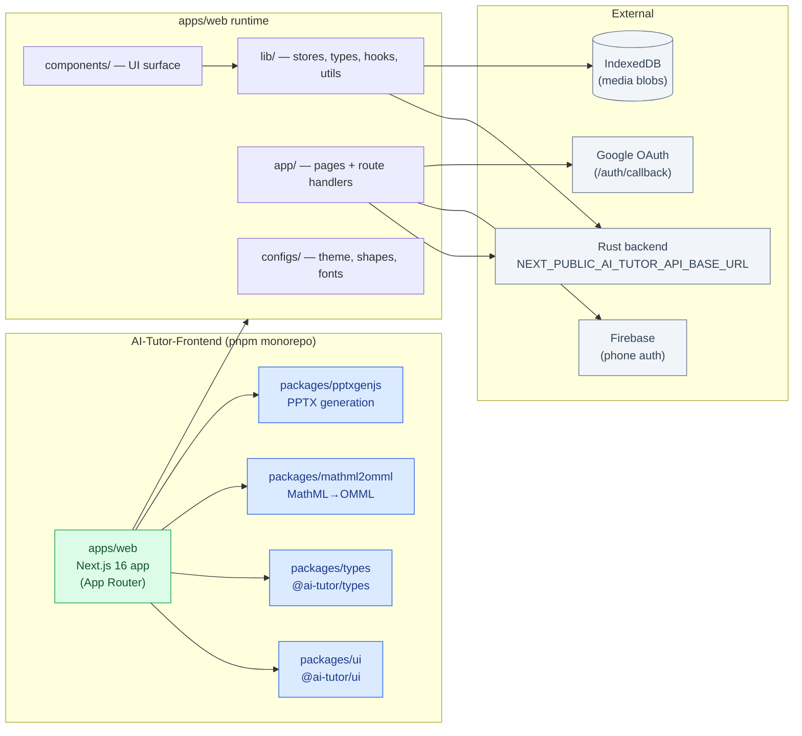
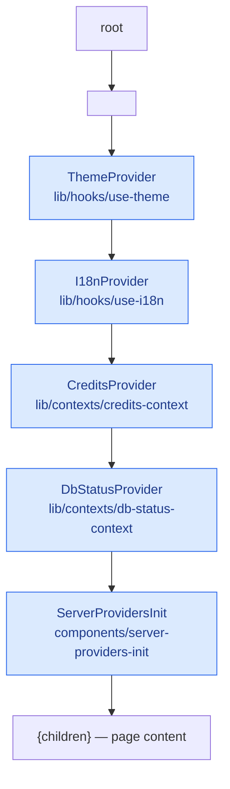
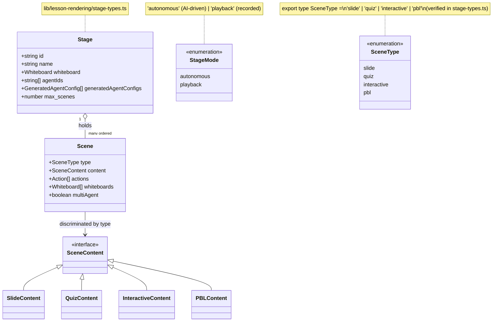
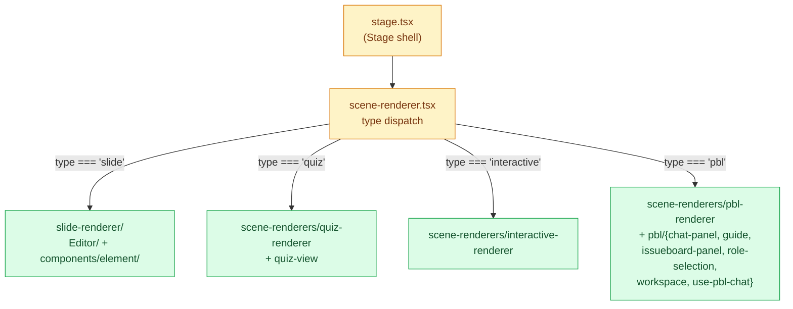
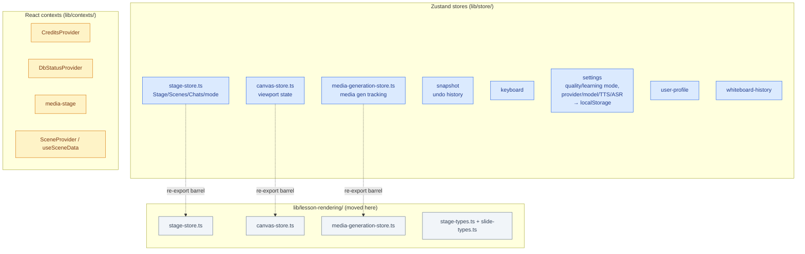
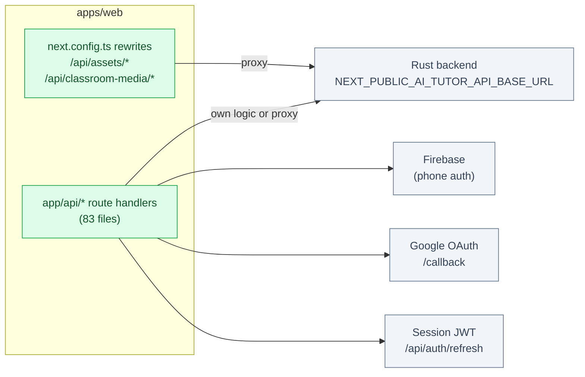

# AI-Tutor Frontend Architecture

> Source root: `AI-Tutor-Frontend/`
> Last verified: 2026-08-26 (read against the working tree, `package.json`s, `layout.tsx`, and `stage-types.ts`)

## 1. Purpose

A **pnpm monorepo** shipping one Next.js 16 app plus four workspace packages.
The app is a rich, client-heavy "interactive classroom" studio: PDF ingest →
AI lesson generation → a Stage of Scenes (slide / quiz / interactive / PBL)
with TTS, multi-agent roundtable, whiteboard doubt-solving, and PPTX export.

## 2. High-level system topology

The frontend is a client of the Rust backend. Heavy generation runs on the
backend; the frontend orchestrates media, renders the Stage of Scenes, and
owns PDF parsing, PBL MCP, billing checkout, and email.



## 3. Workspace layout

```
AI-Tutor-Frontend/
├── package.json              # root scripts; pnpm@10.28.0; tailwindcss 4
├── pnpm-workspace.yaml        # packages: apps/*, packages/*
├── pnpm-lock.yaml
├── vercel.json                # framework nextjs, build pnpm build, out apps/web/.next
├── Dockerfile                 # node:20, runs `next dev` on :4040 (dev image)
├── apps/
│   └── web/                   # the Next.js 16 app (see below)
└── packages/
    ├── ui/                    # @ai-tutor/ui — single src/index.tsx re-export
    ├── types/                 # @ai-tutor/types — single src/index.ts
    ├── mathml2omml/           # MathML→Office OMML converter (rollup, JS)
    └── pptxgenjs/             # PPTX generation lib (rollup, TS) — forked/vendored
```

### Build

- Root `build`: `pnpm --filter mathml2omml build && pnpm --filter pptxgenjs build
  && pnpm --filter ai-tutor-web build`. The two rollup packages must build
  before the app because the app imports them via `transpilePackages`.
- App dev: `next dev --webpack` (Webpack, not Turbopack). App build:
  `pnpm --filter mathml2omml build && next build --webpack`.
- `onlyBuiltDependencies: tesseract.js` (native build allowlist).

## 4. The app: `apps/web`

Next.js 16, React 19.2, TypeScript 5, Tailwind 4, Zustand 5, ProseMirror,
ECharts 6, @xyflow/react, KaTeX/temml, pdfjs-dist + tesseract.js, Firebase,
i18next, motion, shadcn/ui, @ai-sdk/* + @copilotkit/* + @modelcontextprotocol/sdk.

```
apps/web/
├── next.config.ts            # standalone (non-Vercel/win), rewrites → backend, CSP
├── app/                      # App Router (pages + route handlers)
│   ├── layout.tsx            # ThemeProvider › I18nProvider › Credits › DbStatus › ServerProvidersInit
│   ├── page.tsx              # landing
│   ├── classroom/page.tsx    # main dashboard: shelf + generator
│   ├── lessons/[id]/...      # classroom/lesson runtime
│   ├── generation-preview/   # preview layout + components + types
│   ├── operator/             # operator admin (billing, health, jobs, promo, schools, settings, users)
│   ├── billing/, pricing/, check-billing/, auth/ (callback, verify-phone)
│   └── api/                  # 83 route.ts handlers (see below)
├── components/               # UI surface (see below)
├── lib/                      # client logic, stores, types, hooks, utils (see below)
├── configs/                  # animation/chart/element/font/hotkey/image-clip/latex/
│                             #   lines/mime/shapes/storage/symbol/theme
├── assets/, public/, community/, skills/openmaic/
├── components.json (shadcn), eslint.config.mjs, vitest.config.ts, postcss.config.mjs
```

### 4.1 Root provider nesting

The root `layout.tsx` wraps the app in a fixed provider stack. Order matters —
each outer provider may need to read state set by an inner one (e.g. ThemeProvider
reads persisted theme before paint). Verified directly from `layout.tsx`.



### 4.2 `app/api/` — route handlers (83 files; mix of own-logic and backend-proxy)

Verified by listing all `app/api/**/*.ts`:
- **Auth:** `auth/{bind-phone, google/{callback,login,onetap}, refresh}`
- **Generation:** `generate/{image,tts,video}`, `generate-classroom[/{jobId}]`,
  `lessons/{generate,preview,route}`, `lessons/jobs/[id][/[action]]`
- **Lessons runtime:** `lessons/[id]/{doubt[/{wbId}], export/{html,video}}`,
  `lesson-shelf[/{id}/{archive,reopen,retry}, mark-opened]`
- **PBL:** `pbl/chat` (has `.test.ts`)
- **Media/parse:** `parse-pdf[/{ocr}]`, `proxy-media`, `classroom-media/[classroomId]/[...path]`,
  `azure-voices`, `transcription`, `verify-{image,video}-provider`
- **Billing/credits:** `billing/{catalog,checkout,dashboard,orders,topup/{pay,validate},
  invoices/[id]/pdf}`, `credits/{deduct-lesson,redeem}`, `subscriptions/{[id]/cancel,create,me}`
- **Operator:** `operator/{auth/{logout,request-otp,verify-otp}, api-costs, health[/{toggle}],
  jobs, overview, promo-codes, settings[/{...}], schools/...,
  stats/{payments,promo-codes,queue-depth,revenue-timeseries,subscriptions,users},
  users/.../{credits,ledger,topup-link}, billing/invoices/[id]/pdf}`
- **System/internal:** `health`, `system/{db-ready,status}`, `internal/send-email`,
  `server-providers`, `chat`, `quiz-grade`

> Some of these call the Rust backend (`NEXT_PUBLIC_AI_TUTOR_API_BASE_URL`);
> others own logic (PDF parsing via pdfjs/tesseract, PBL MCP, billing checkout,
> email via nodemailer, server-providers init). Always open the route file
> before assuming where behavior lives.

### 4.3 `lib/` — client architecture

- **`lesson-rendering/`** — the store and type definitions that back the
  `components/lesson-rendering/` module. These moved here from `lib/store/`
  and `lib/types/` to collocate the rendering state model with the rendering
  components. Re-export barrels at the old paths (`lib/store/stage.ts`,
  `lib/store/canvas.ts`, `lib/store/media-generation.ts`, `lib/types/stage.ts`,
  `lib/types/slides.ts`) preserve backward-compatible imports.
  - `stage-store.ts` — Stage/Scenes/Chats/mode/generation state.
  - `canvas-store.ts` — canvas viewport state.
  - `media-generation-store.ts` — media generation tracking.
  - `stage-types.ts` — `Stage`, `Scene`, `SceneContent`, `StageMode`, and
    per-scene content types (`SlideContent`, `QuizContent`,
    `InteractiveContent`, `PBLContent`).
  - `slide-types.ts` — PPT element types (`PPTImageElement`, `PPTTextElement`,
    etc.) for the slide renderer.
- **`store/`** (Zustand): re-exports stores via `index.ts` (the "new
  architecture" stores + the `SceneProvider`/`useSceneData` context API).
  Remaining stores: `snapshot` (undo history), `keyboard`, `settings`
  (quality/learning mode, provider/model selection, TTS/ASR/image/video/PDF
  provider config, persisted to localStorage), `user-profile`,
  `whiteboard-history`, `settings-validation`. `stage.ts`, `canvas.ts`, and
  `media-generation.ts` are now re-export barrels pointing to
  `lib/lesson-rendering/`.
- **`api/`** — the **Stage API** ("AI Agent Toolkit"): `stage-api.ts`
  composes `stage-api-{scene,element,canvas,navigation,whiteboard,mode,types,
  defaults}`. `createStageAPI(store)` returns `{scene,navigation,element,
  canvas,whiteboard,mode,stage}`. This is the programmatic surface AI agents
  use to build/edit classroom content.
- **`types/`** — `action`, `chat`, `edit`, `export`, `generation`, `pdf`,
  `provider`, `roundtable`, `settings`, `slides` (re-export barrel), `stage`
  (re-export barrel), `whiteboard-doubt`. Core model: `Stage` {id,name,
  whiteboard,agentIds,generatedAgentConfigs,max_scenes,...}; `Scene`
  {type:'slide'|'quiz'|'interactive'|'pbl', content, actions, multiAgent,...};
  `StageMode` 'autonomous'|'playback'. The `stage` and `slides` type
  definitions now live in `lib/lesson-rendering/`; the files here are
  backward-compatible re-export barrels.
- **`media/`** — `media-orchestrator.ts` (dispatches image/video gen via
  `/api/generate/{image,video}`, stores blobs in IndexedDB, updates store);
  `image-providers`, `video-providers`, `types`, and `adapters/` for
  grok/kling/minimax/nano-banana/qwen/seedance/seedream/veo.
- **`audio/`** — `tts-providers`, `asr-providers`, `voice-resolver`,
  `browser-tts-preview`, `use-tts-preview`, `constants`, `types`.
- **`pdf/`** — `parse-for-session`, `page-summarizer`, `semantic-router`,
  `registry`, `plugin`, `plugins/{pdfjs-plugin,tesseract-ocr}`, `constants`,
  `types`.
- **`pbl/`** — `generate-pbl`, `pbl-system-prompt`, `types`, `mcp/`
  (`agent-mcp`, `agent-templates`, `issueboard-mcp`, `mode-mcp`, `project-mcp`).
- **`orchestration/`** — `director-prompt.ts`, `registry/{store,types}`
  (agent registry; the types file states it is NOT used by the generation
  pipeline, which is Rust-backed).
- **`export/`** — `html-parser/{format,index,lexer,parser,stringify,tags,types}`,
  `latex-to-omml`, `svg-path-parser`, `svg2base64`, `use-export-pptx`,
  `svg-arc-to-cubic-bezier.d.ts`.
- **`playback/`** — `engine`, `derived-state`, `index`, `types`.
- **`prosemirror/`** — `commands/` (replaceText, setListStyle, setTextAlign,
  setTextIndent, toggleList), `plugins/` (inputrules, index), `index`.
- **`hooks/`** — use-audio-recorder, use-browser-{asr,tts}, use-canvas-operations,
  use-discussion-tts, use-draft-cache, use-history-snapshot, use-order-element,
  use-slide-background-style, use-streaming-text, use-i18n, use-theme.
- **`contexts/`** — credits, db-status, media-stage, scene.
- **`action/`**, **`ai/`** (providers), **`auth/`** (firebase, session),
  **`buffer/`** (stream-buffer + test), **`chat/`** (action-translations),
  **`constants/`** (generation), **`i18n/`** (config, index, locales, types),
  **`lesson/`** (shelf-client), **`server/`**, **`storage/`**, **`utils/`**,
  `logger.ts`.

### 4.4 `components/` — UI surface

- `ai-elements/` (30+): artifact, canvas, chain-of-thought, checkpoint,
  code-block, confirmation, connection, context, controls, conversation,
  edge, image, inline-citation, loader, message, model-selector, node,
  open-in-chat, panel, plan, prompt-input, queue, reasoning, shimmer,
  sources, suggestion, task, tool, toolbar, web-preview.
- `lesson-rendering/` — the consolidated **lesson creation + rendering
  module**. This is the frontend counterpart to the backend
  `orchestrator/generation/` folder: everything that controls how a lesson
  is rendered and interacted with lives here. Re-export barrels at the old
  paths (`components/stage.tsx`, `components/canvas/`, `components/lesson/`,
  `components/scene-renderers/`, `components/slide-renderer/`) preserve
  backward-compatible imports.
  - `stage.tsx` — the Stage shell (scene dispatch, sidebar, canvas, chat,
    roundtable, playback, action engine, TTS).
  - `stage/` — `scene-renderer.tsx` (type dispatch to Slide/Quiz/Interactive/
    PBL renderers), `scene-sidebar.tsx`.
  - `scene-renderers/` — `interactive-renderer`, `quiz-renderer`, `quiz-view`,
    `pbl-renderer` + `pbl/{chat-panel, guide, issueboard-panel, role-selection,
    use-pbl-chat, workspace}`.
  - `slide-renderer/` (59 files) — full slide editor/renderer: `Editor/`
    (Canvas with Operate/, Highlight/Laser/Spotlight overlays, ScreenCanvas,
    ZoomWrapper, Ruler) and `components/element/` (Audio, Chart, Image+ImageClip/
    ImageOutline, Latex, Line, ProsemirrorEditor, Shape+GradientDefs/PatternDefs,
    Svg, Table+StaticTable, Text, Video) + ThumbnailSlide.
  - `canvas/` — `canvas-area` (the playback surface), `canvas-toolbar`.
  - `lesson/` — studio UI: `learning-style-dialog`, `max-scenes-dialog`,
    `scene-checkin-widget` (+ test), `studio-input-bar`, `studio-scene-strip`.
- `chat/` — chat-area, chat-session, inline-action-tag, lecture-notes-view,
  proactive-card, session-list.
- `classroom/` — classroom-sidebar, share-lesson-dialog.
- `generation/` — generating-progress, generation-toolbar, media-popover,
  mode-selector, outlines-editor.
- `landing/` — final-cta, mission-section, use-cases-section.
- `layout/` — credits-display, dashboard-shell, left-sidebar, site-header,
  user-menu.
- `roundtable/` — index, audio-indicator, presentation-speech-overlay.
- `settings/` — add-provider-dialog, asr/audio/general/image/model-edit/
  model-selector/pdf/provider-config-panel/provider-list/tts/video settings, index.
- `whiteboard/` — index, whiteboard-canvas, whiteboard-doubt-session,
  whiteboard-history.
- `audio/` — speech-button, tts-config-popover.
- `auth/` — google-one-tap.
- `header.tsx`, `aurora-effect.tsx`, `language-switcher.tsx`,
  `server-providers-init.tsx`, `user-profile.tsx`, `ui/` (shadcn primitives).

### 4.5 Packages

- `@ai-tutor/ui` — `src/index.tsx` (re-export hub; thin).
- `@ai-tutor/types` — `src/index.ts` (shared types hub; thin).
- `mathml2omml` — JS lib (rollup), `src/mathml/*` (mfrac, mroot, mrow, msqrt,
  msub/sup, mmultiscripts, munderover, table, text, menclose, mglyph, mspace,
  mstyle), `src/ooml/` (nary, scriptlevel), `src/parse-stringify/`, `walker.js`.
- `pptxgenjs` — TS lib (rollup), `src/{pptxgen,slide,gen-xml,gen-objects,
  gen-charts,gen-tables,gen-media,gen-utils,core-enums,core-interfaces}`. Used
  by `lib/export/use-export-pptx`.

## 5. Data & state model

The core domain model is the **Stage → Scenes** hierarchy. A Stage is a
course; it holds an ordered list of Scenes, each with a `type` and
type-specific `content`, optional `actions` (playback script), optional
`whiteboards`, and optional `multiAgent` config.



- **SceneType**: `slide | quiz | interactive | pbl` — each has a dedicated
  renderer in `components/lesson-rendering/scene-renderers/` (and
  `components/scene-renderers/` re-export barrel).
- **StageMode**: `autonomous` (AI-driven) | `playback` (recorded).
- Generation is two-stage (verified in `lib/types/generation.ts`):
  (1) requirements + docs → Scene Outlines; (2) outlines → full Scenes with
  actions. The heavy generation runs on the Rust backend; the frontend
  orchestrates media (image/video) and stores blobs in IndexedDB.
- Settings store maps `qualityMode` (basic/standard/premium) and
  `learningMode` (explain/revision/exam/placement_prep) to the backend model
  stack — these mirror the backend `engine.rs` knobs.

## 6. Scene rendering dispatch

The Stage shell dispatches each Scene to a type-specific renderer. Verified
from `stage/scene-renderer.tsx` and the scene type union in `stage-types.ts`.



## 7. State management architecture

State is split between Zustand stores (for app/global state) and React context
(for scoped providers). The `lesson-rendering/` stores hold the Stage model;
`settings` persists user preferences to localStorage and mirrors backend
knobs.



## 8. Backend integration

- Base URL: `NEXT_PUBLIC_AI_TUTOR_API_BASE_URL` (default `http://localhost:8000`
  in next.config rewrites; compose uses `http://localhost:4041`).
- `next.config.ts` rewrites `/api/assets/*` and `/api/classroom-media/*`
  straight to the backend; other `/api/*` are real route handlers.
- CSP is strict (script-src allowlist for Google/Firebase; connect-src `*`).
- Auth: Firebase (phone) + Google OAuth (callback at `/auth/callback`) +
  session JWT (refresh at `/api/auth/refresh`).



## 9. Tests

- `vitest.config.ts` at app root. Test files live beside code:
  `lib/buffer/stream-buffer.test.ts`, `lib/media/media-orchestrator.test.ts`,
  `app/api/lesson-shelf/[id]/retry/route.test.ts`, `app/api/pbl/chat/route.test.ts`.
- `@playwright/test` is a dev dep (e2e config not found at app root — check
  before assuming a playwright suite is wired).

## 10. What is NOT here

- No Redux; state is Zustand + React context.
- No separate SSR data layer; App Router route handlers + client stores.
- The `community/feishu.md` and `skills/openmaic/` are docs/scratch, not app
  code paths.
- `fix.js`, `replace_colors.js`, `replace_slate*.py` at the frontend root are
  one-off style scripts, not part of the build.
